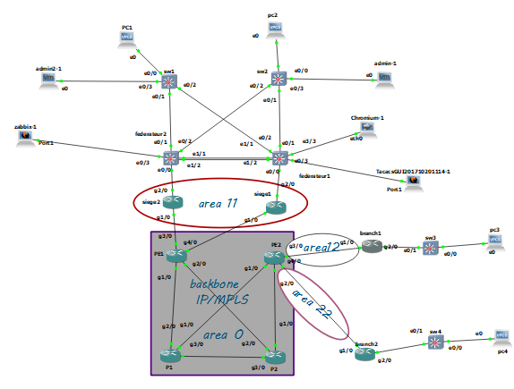

# Projet Réseau MPLS

## Introduction
Ce projet décrit l'implémentation d'un réseau MPLS (Multi-Protocol Label Switching) avec plusieurs branches, sièges,un système d'authentification Tacacs et un système de surveillance à l'aide de Zabbix.

## Architecture
L'architecture du réseau inclut :
- 4 routeurs MPLS (PE1, PE2, P1, P2)
- 2 branches (Branch 1 et Branch 2)
- 2 sièges (Siège 1 et Siège 2)
- Zabbix pour la surveillance
- TACACS+ pour l'authentification réseau
- 2 fédérateurs et 2 switches
- 2 PCs et 2 administrateurs pour la gestion.

### Diagramme de l'architecture
Voici l'image de l'architecture du réseau MPLS :

## Protocoles utilisés
- MPLS (Label Distribution Protocol)
- BGP pour l'échange de routes entre PE1 et PE2
- OSPF comme protocole IGP

## Configuration des équipements
Les configurations de tous les équipements (routeurs, switches, PCs) sont incluses dans ce dépôt.

## Tests
Les tests ont été effectués avec succès pour valider la connectivité entre les branches et les sièges via MPLS.

### Vidéo de test
Une vidéo démontrant le fonctionnement et les tests du réseau est incluse. Vous pouvez la visualiser en téléchargeant et en lisant le fichier localement :

[Vidéo de test du réseau](./videos/project réseau.mp4)

## Rapport du projet
Un rapport complet décrivant les étapes du projet, les configurations et les résultats des tests est disponible dans ce dépôt.

[Rapport complet du projet](./rapport/projet_réseau.pdf)
